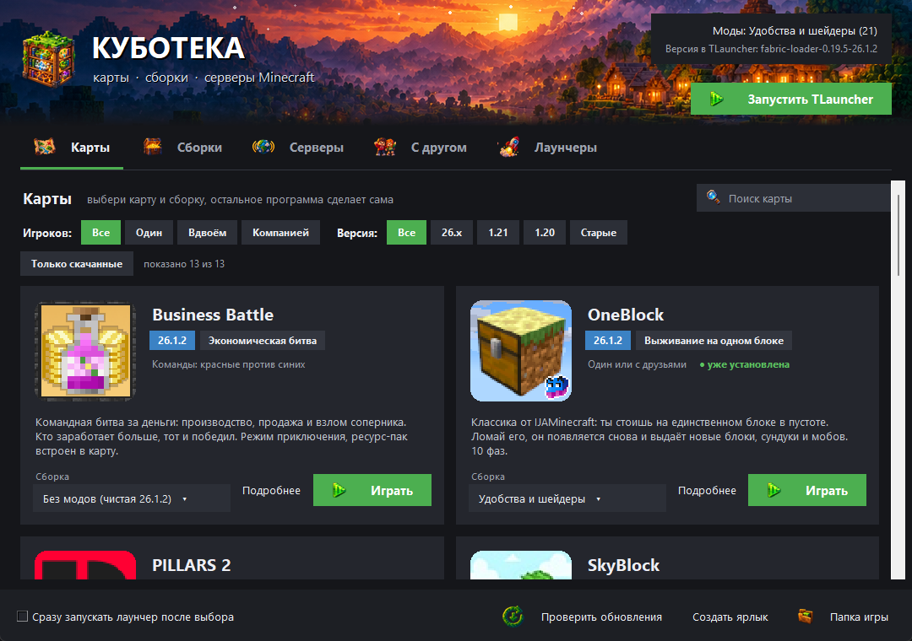

# Куботека

Программа для Windows, которая одной кнопкой ставит карты и сборки модов Minecraft, выбирает нужную версию в TLauncher, добавляет серверы и помогает играть с другом через Hamachi или Radmin VPN.

## Как скачать

1. Скачай **[Minecraft-Packs.zip](https://github.com/SKUF666/minecraft-packs/releases/latest/download/Kuboteka.zip)**.
2. Распакуй его в любую папку и запусти «Куботека.exe».
3. Выбирай карту или сборку: программа скачает её с сайта автора, моды с Modrinth и CurseForge.

Потом программа сама проверяет обновления при запуске и скачивает только то, что изменилось.

Windows может предупредить, что программа неизвестного издателя: она не подписана сертификатом. Нажми «Подробнее» → «Выполнить в любом случае».

## Что внутри

- `src/PackSwitcher.pyw` — исходник программы (Python + tkinter). Из него собран exe (PyInstaller).
- `tools/publish.py` — выпуск новой версии: делит библиотеку на части (сборки, карты, файлы программы) и загружает в релиз `library` только изменённые части вместе с описью `manifest.json`.

Карты и моды принадлежат их авторам: ссылки на источники есть в описании каждой карты и в каталоге модов. Карты, авторы которых запрещают перезаливы, здесь не выкладываются.
